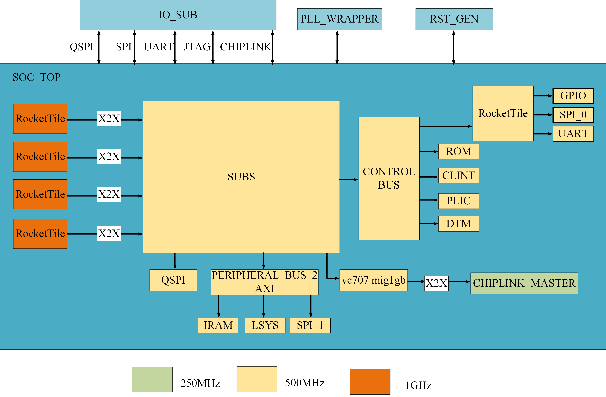
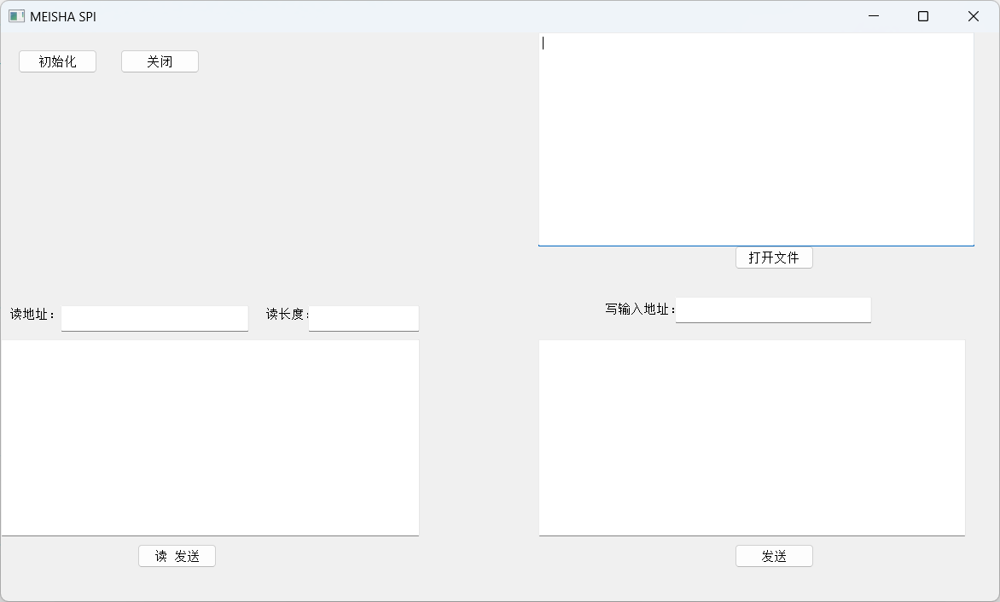

# MEISHA V100 FPGA -- User Guide
# 1. Introduction      

### 1.1 Overview
The MEISHA V100 FPGA User Guide provides comprehensive documentation for implementing and validating the MEISHA V100 processor on a Xilinx VC707 FPGA board. This open-source project, developed by the RISC-V Group at Shenzhen University of Advanced Technology (SUAT), includes:
- Complete Verilog source code
- Vivado project files
- Bitstream files
- Supporting documentation

### 1.2 Software Environment

#### Development Platform
- Ubuntu 22.04 operating system
- RISC-V toolchain
- Vivado 2016.4 development environment

#### Boot Process
- maskROM bootloader
- SD card Linux image loading
- Linux system initialization

#### Development Tools
- OpenOCD debug environment
- Vivado simulation and debug tools
- Linux development environment

### 1.3 Project Features

#### Open Architecture
- Complete open-source design
- Detailed documentation
- Extensible architecture

#### Verification Completeness  
- FPGA prototype validation
- Complete boot flow
- Debug support

#### Practicality
- Linux system support
- Rich peripheral interfaces
- Flexible configuration options

### 1.4 Target Applications
The MEISHA V100 platform is designed for:
- Processor prototype validation
- Hardware/software interface verification
- RISC-V architecture education and research
- Embedded system development

### 1.5 Project Contributors
RISC-V Group, Faculty of Computing Microelectronics, SUAT
- Group Leader: Li HY, Mark
- Module Design: Zhou JL, Chen WH, Zhang YF, Huang XC, Yang X, Wang JX, Deng RF  
- FPGA Verification: Wu WH, Huang YH
- Documentation: Li ZL

This guide aims to provide users with comprehensive instructions from hardware setup to software development, enabling rapid understanding and utilization of the MEISHA V100 platform for development purposes.
# 2 System Architecture

## 2.1 Core Architecture

The MEISHA V100 contains four 64-bit RISC-V RV64GC [Rocket cores](https://github.com/chipsalliance/rocket-chip)
a 5-stage in-order scalar pipeline, comprehensive peripherals and interfaces. The system architecture is designed for flexibility, performance, and easy verification on FPGA platforms.

#### Processing Units
- Four 64-bit RISC-V RV64GC Rocket cores
- 5-stage in-order scalar pipeline 
- RocketTile interconnection via S-BUS

#### Memory Hierarchy
- DDR3 main memory (via MIG 7 IP core)
- On-chip IRAM for fast resource access
- SD card external storage
- Boot ROM storage

#### Bus Architecture
- S-BUS: Core interconnection
- PERIPHERAL_BUS (AXI-based): Peripheral IP Interconnect: e.g. uart/sd/spi
- CONTROL_BUS: System control IP Interconnect: e.g. plic/clint/debug
- Chiplink: Chip-to-chip communication interface

#### Key Peripheral Interfaces
- UART: Serial communication
- SPI/QSPI: High-speed serial interface, Support Master/Slave Mode
- GPIO: General-purpose I/O
- JTAG: Debug interface

#### System Control
- PLL_WRAPPER: Clock management
- RST_GEN: Reset control
- CLINT: Core Local Interrupt Controller
- PLIC: Platform Level Interrupt Controller
- DTM: Debug and Trace Module


Each MEISHA V100 SoC contains four 64-bit RISC-V RV64GC [Rocket cores](https://github.com/chipsalliance/rocket-chip)
 an in-order scalar processor with 5-stage pipeline. 
In order to accelerate processor prototyping and provide a flexible framework for hardware/software interface validation, the FPGA prototype based on MEISHA V100 is publicly released. 
## 2.2 Block Diagram

In this project, MEISHAV100_TOP is the top layer of FPGA prototype verification project.
The overall architecture of MEISHA V100 is shown in **_Figure 1_**. The frequency in the chart needs to be proportionally downscaled in the FPGA.


<div align=center>   

 

<div>       

<div align=center>    

**_Figure 1:_**  _Block Diagram_

<div>    

<div align=left>   
<div> 

# 3. Hardware Requirement    

## 3.1 Xilinx Virtex-7 FPGA VC707   


<div align=center>      

**_Figure 2:_**  _Xilinx VC707_

<div>  

<div align=left>   
<div>        


The Virtex®-7 FPGA VC707 Evaluation Kit is a fully featured, highly flexible high-speed serial base platform, utilizing the Virtex-7 XC7VX485T-2FFG17610. This platform includes essential hardware, design tools, IP cores, and pre-verified reference designs for systems requiring high-performance serial connectivity and advanced memory interfaces.      
## 3.2 Board Setup
### 3.2.1 Boot Mode Setup
The project currently supports two boot modes, from SD card or from IRAM, selecting by binding the top-level signal DEBUG_MODE_SEL to the first on-board DIP switch. 
If the signal is 0 (DIP switch up), the system boots from  SD card.
If the signal is 1 (DIP switch down), the system boots from IRAM. Other DIP switches (second to eighth) are set to "0000000", See Figure 3 for the dip switch setup diagram.


<div align=center>      

**_Figure 3:_**  _Board Setup_

<div>  

<div align=left>   
<div>        

### 3.2.2 VC707 Power and Serial Terminal Setup
Connect the VC707 power adapter that comes with the circuit board to power the VC707. Connect the USB Type-a to Type mini-B USB cable provided by the VC707 kit for hardware jtag burning, and connect the J17 connector to the VC707 for UART communication with the host.

Open a terminal connection from the host to the MEISHAV100 VC707 FPGA development board using programs such as Minicom or Screen on Linux, or MobaXterm on Windows. 

## 3.3 SD Card as External Memory

The SD Card should conform to SD specification 2.00 or later. This section demonstrates the implementation with Kingston's 64GB SDHC memory card and SD adapter.

Following instructions from Session on softare development flow, prepare a SDHC Card with Linux boot image. Then install SD Card in the VC707 SD Card slot

# 4. Software Requirement
+ Operating system
ubuntu22.04 is suggested.
  

First,  git clone the project.      
`$ git clone `  

Then update software dependencies before downloading them.   

`$ sudo apt update`  
`$ sudo apt upgrade`       

Install the following software dependencies.   

`$ sudo apt-get install autoconf automake autotools-dev curl libmpc-dev libmpfr-dev libgmp-dev libusb-1.0-0-dev gawk build-essential bison flex texinfo gperf libtool patchutils bc zlib1g-dev device-tree-compiler pkg-config libexpat-dev python wget`  

`$ sudo apt-get install default-jre`    

+ Install the tool chain  
Running the project also requires installing the required RISC-V toolchain for compilation on the software, the RISC-V software toolchain must be installed locally, and the $(RISCV) environment variable must be set to point to the installed RISC-V toolchain. 
The toolchain can be built from source: https://www.sifive.com/products/tools/. If the RISC-V toolchain is already installed, please run the following command.      

**<font color = Fuchsia>Note: Do not include /bin at the end of the string. </font>**     

`$ export RISCV=/home/riscv/riscv64-elf-tc`  
+ Install vivado2016.4  
This project tested can only use vivado2016.4 version to build, other newer versions will have errors.
  
# 4.FPGA Implementation    

## 4.1 Top Architecture    


Figure 4 shows the schematic diagram of the verification.   

<div align=center> 


<div>   

<div align=center>    

**_Figure 4:_**  _schematic of the verificaiton_

<div>    

<div align=left>   
<div>  
  


## 4.2 Clock and Reset    

After the clock of the VC707 on-board differential clock source is converted into a single-ended clock through an IBUFDS primitive, xilinx's PLL IP core module will generate 3 CLKS, which are respectively provided to rockecttile, chiplink module and other sub. The chip is expected to support RocketTile using 1GHz clock, CHIPLINK module using 250M clock, and other modules using 500M clock, but currently in the FPGA prototype verification project, except chiplink module using 150MHz clock, other unified use 50MHz clock. Otherwise, too high a frequency will lead to timing violations. This is typically because the FPGA's fabrication process and routing delays cannot meet the high-frequency requirements of an SoC ASIC design. This is a common trade-off in FPGA prototyping.    

The top layer ResetGEN module generates multiple resets, which are respectively provided to rockecttile, chiplink module and other subs. It is expected to support the reset signal generated after RocketTile uses 1G clock to beat, and the reset signal generated after CHIPLINK module uses 250M clock to beat. The reset signal generated after other modules use the 500M clock is supported. See **_Figure 5_** for the reset timing diagram.   


<div align=center>  


**_Figure 5:_**  _Clock and reset time sequence diagram_   

<div>
<div align=left><div>   
  

## 4.3 Mapping of Main Memory  
### 4.3.1 On-Board DDR3 Memory 
The verification board VC707 contains DDR3 memory, by using  Xilinx MIG 7 IP core.  

### 4.3.2 Added IRAM Module    
MEISHA V100 designs an IRAM module to quickly access on-chip resources, mainly used to store frequently accessed stacks, hot data, hot programs, etc. The IRAM module supports axi fix and incr operation types, burst 1-16 operation types, narrow operation and sparse operation, but does not support wrap operation. Meanwhile, wstrb needs to be consistent with size, and invalid bits need to be set to 0.  

### 4.3.3 SD Card as External Memory  
This verification utilizes a Kingston's 64GB SDHC memory card and SD adapter.  


## 4.4 Peripheral Architecture    
The peripherals of this project and the memory mapping of peripherals are shown below. 


<div align=center>          

**_Table 1:_**  _Peripheral and  Memory Map_  

<div>
<div align=left><div> 


|Base|Size|Description|Notes|
|:-:|:-:|:-:|:-:|
|0x0000_0000|4K|debug-controller||
|0x0000_3000|4K|error-device||
|0x0001_0000|8K|mask rom||
|0x0200_0000|64k|clink||
|0x0c00_0000|4M|plic||
|0x5000_0000|512K|on chip sram||
|0x5100_0000|4K|soc_lsys||
|0x5200_0000|4K|spi_1||
|0x6000_0000|64M|timeout||
|0x6400_0000|4K|serial|narrow or sparse is not supported|
|0x6400_1000|4K|spi_0|narrow or sparse is not supported|
|0x6400_2000|4K|gpio|narrow or sparse is not supported|
|0x8000_0000|1G|DDR(CHIPLINK)||
|0Xc000_0000|1G|timeout|this space is not accessible and access will case the bus to crash|


## 4.5 Chiplink Module  
ChipLink is a low-speed interchip bus communication protocol (between FPGA and SoC) proposed by SiFive, which is mainly used for shard transmission and recombination of AXI4 requests sent by SoC to reliably access hardware logic resources on FPGA. The ChipLink controller Verilog code on the FPGA core board was generated by Chisel and has been emulated on the VCS.  

Tilelink bus is mainly used in this project, so it is not necessary to convert AXI request into TileLink request. Instead, TileLink request can be directly converted into Chiplink request, and then SoC signal can be transmitted to FPGA through ChipLink transmission. The FPGA side needs to combine the TileLink request according to the ChipLink protocol, then convert the TileLink request back to the AXI request through the switching bridge, and finally exchange data with the MIG IP core on the FPGA through a series of switching Bridges, so as to realize the memory access operation of DDR on the FPGA.  

Tested on VC707, when Chiplink uses 150MHz and 200MHz clocks, Vivado software will prompt that it cannot meet the timing requirements. However, the actual measured result is that Chiplink can still work normally at 150MHz, but not at 200MHz.  

**Note:     
The address range of the Chiplink we use is from `0x8000_0000` to `0xDfff_ffff`.   
This address range represents the memory-mapped addresses that the SoC uses to access the external device (the DDR3 on the FPGA) via the ChipLink protocol. Reading and writing Chiplinks in other address ranges will report a slave error.**     


## 4.6 MEISHAV100 on Vivado

The RTL Top Design diagram of MEISHA on Vivado simulation is shown asynchronous:  

<div align=center>   

     

**_Figure 6:_**  _Top Design diagram of MEISHA V100 on Vivado_
<div>
<div align=left><div>   
  

- **ZYNQ7 Processing System** - PS-side processor system

  Requires the use of AXI_HP port
  
  Clock use the clock provided by the PS side, frequency as needed (Chiplink module's clock cannot use 200Mhz or higher, unable to meet timing requirements!)
  
  Pin binding as needed, for example, the ZYBO 7020 development board can refer to the example

- **AXI Interconnection** - AXI intelligent interconnect module

  Here, AXI Interconnection has two functions
  
  1. Synchronize AXI signals across clock domains, Chiplink uses a clock that is inconsistent with the DDR interface
  
  2. Convert Chiplink's AXI4 port signals to AXI3 port signals of the DDR interface
  
  The above operations are automatically completed by the AXI Interconnection module

- **Processor System Reset** - Synchronized reset module

  Regardless of whether the reset signal is a synchronous or asynchronous reset, the Block Design will give serious warnings, requiring modification of port attributes, or all use synchronous reset
  
  Therefore, Processor System Reset can be used to synchronize the reset signal to a certain clock, or a synchronized reset module can also be written (actually tested and works)

- **Chiplink** - Symmetric structure, has one master port and one slave port, two Chiplink are actually the same, only the masked ports are different when instantiated  

The configurations of relavant IP cores are described as following:  

1. **RocketTile**:
   - These modules are processor cores responsible for executing instructions and processing data. Each RocketTile represents an independent processor core, which communicates via the S-BUS.

2. **S-BUS**:
   - The S-BUS is a system bus that connects the various processor cores to other modules, providing a channel for data and instruction transfer. It links to downstream buses (such as the CONTROL_BUS and PERIPHERAL_BUS). TileLink is the specific protocol implemented by this bus in this project.

3. **QSPI**:
   - QSPI (Quad Serial Peripheral Interface) is a high-speed serial interface used for fast data transmission. It typically connects external memory or other high-speed peripherals.

4. **PERIPHERAL_BUS_2 (AXI)**:
   - AXI (Advanced eXtensible Interface) is a high-performance bus interface used to connect various peripheral devices. PERIPHERAL_BUS_2 interfaces with other modules through AXI.

5. **IRAM/LSYS**:
   - IRAM (Instruction RAM) stores instructions.
   - LSYS is a local system module responsible for system-level control and management.


6. **chiplink D2D**:
   - chiplink D2D is a chip-to-chip direct data transfer interface used for efficient data exchange between chips.

7. **CONTROL_BUS**:
   - CONTROL_BUS transmits control signals and connects to modules such as ROM, CLINT, PLIC, and DTM.

8. **ROM/CLINT/PLIC/DTM**:
   - ROM (Read-Only Memory) stores fixed programs or data.
   - CLINT (Core Local Interrupt Controller) handles interrupt requests at the core level.
   - PLIC (Platform Level Interrupt Controller) manages interrupt requests across the platform.
   - DTM (Debug and Trace Module) is used for debugging and monitoring system operations.

9. **PERIPHERAL_BUS_0**:
    - PERIPHERAL_BUS_0 connects to external devices via GPIO, SPI_0, SPI_1 and UART interfaces.

10. **PLL_WRAPPER**:
    - PLL (Phase-Locked Loop) generates stable clock signals. PLL_WRAPPER might be a wrapper module for PLLs, providing clock signal management and distribution.

11. **RST_GEN**:
    - RST_GEN is the reset generator used to produce reset signals for initializing the system.

12. **PAD_IO_SUB**:
    - PAD_IO_SUB is the input/output (I/O) port module used for physical connections to external devices.


## 4.7 Software Simulation with Vivado     

+ Write tb.v file, the project has provided relatively simple simulation files, but if you have higher simulation requirements, please add the files required for the simulation  
+ Click on Tools→click on settings→click on simulation →Compile Simulation Libraries  
+ Click on simulation→Select the emulator that you wish to use.The recommended simulator to use is Vivado, as it don't need to compile simulation libraries and configure the co-simulation.    
+ In Flow Navigator on the left chose Simulation→Run behavioral Simulation. If you want to Post-Synthesis Functional Simulation, click on Functional Simulation.This requires first running the SYNTHESIS.    
  
## 4.8  Inserting Debug Cores for Logic Analyzer    

Build-in logic analyzer allow you to debug FPGA design while  it’s running. Next steps briefly describe how to add debug cores.  
+ Find signals in the design which you want to debug. To make sure that Vivado doesn’t optimize the logic corre sponding and you will be able to access a signal with debug cores, add ( MARK_DEBUG = "TRUE" ) before it. This  directive works with flip-flops and ports, but can not work well with wires. If you need, add additional logic to flip-flop  signals.   
+ Run Synthesis of a design   
+ After synthesis finished, expand Open Synthesized Design tab of Flow Navigator and click on Set Up Debug   
+ Follow the steps in the prompt to add signals for monitoring and to assign clock domain to them   
+ Save the design and finish FPGA flow down to bitstream  generation  when programming FPGA from Vivado, in addition to .bit files specify .ltx files with debug signals names    


# 5. Peripheral Interfaces

## 5.1 UART Interface


The Universal Asynchronous Receiver/Transmitter (UART) provides asynchronous serial communication capability with the following features:
- Full-duplex communication
- Configurable baud rate
- 8-bit data transmission
- Optional parity checking

#### Baud Rate Configuration
The baud rate is determined by the divisor in the Baud Rate Divisor Register (div). The relationship between input clock and baud rate is given by:

$$
f_{baud}=\frac{f_{in}}{div+1}
$$

Where:
- f_baud is the desired baud rate
- f_in is the input clock frequency (bus clock)
- div is the value in the divisor register

#### Supported Baud Rate Configurations

<div align=center> 

**_Table 2:_** _Baud Rate Configuration Examples_
<div align=left><div> 

| tlclk (MHz) | Target Baud (Hz) | Divisor | Actual Baud (Hz) | Error (%) |
|-------------|------------------|---------|------------------|-----------|
| 500         | 31250           | 16000   | 31250           | 0         |
| 500         | 115200          | 4340    | 115207          | 0.0064    |
| 500         | 250000          | 2000    | 250000          | 0         |
| 500         | 1843200         | 271     | 1845018         | 0.099     |
| 750         | 31250           | 24000   | 31250           | 0         |
| 750         | 115200          | 6510    | 6510            | 0.0064    |
| 750         | 250000          | 3000    | 3000            | 0         |
| 750         | 1843200         | 407     | 407             | 0.024     |

<div>

#### Register Map for UART controller
The UART controller provides the following memory-mapped registers:

| Offset | Name   | Description               |
|--------|--------|---------------------------|
| 0x00   | txdata | Transmit data register    |
| 0x04   | rxdata | Receiver data register    |
| 0x08   | txctrl | Transmit control register |
| 0x0C   | rxctrl | Receive control register  |
| 0x10   | ie     | UART interrupt enable     |
| 0x14   | ip     | UART interrupt pending    |
| 0x18   | div    | Baud rate divisor         |

## 5.2 SPI MASTER

SPI MASTER is a serial interface consisting of SCLK (clock signal), MOSI (Master Out Slave In), MISO (Master In Slave Out) and SS (Slave Select) interfaces. It is suitable for low-speed devices with typical transmission speeds around several MHz (though high-speed SPI communication exists, we only discuss traditional SPI here). 

It supports STD SPI, Quad SPI Mode:
1. Single-line SPI mode: Serial transmission/reception of data.
2. Quad-line SPI mode: Simultaneous transmission/reception of 4 bits via IO0/IO1/IO2/IO3 signals.

# 6 OpenOCD Debug
RISC-V OpenOCD is a branch of OpenOCD (Open On-Chip Debugger) specifically designed to support 
the RISC-V architecture. OpenOCD is an open-source on-chip debugger that supports hardware
 debugging, boundary scanning, and on-chip programming via the JTAG interface. RISC-V OpenOCD 
 adds debugging support for the RISC-V architecture, making it more convenient for developers to debug and program RISC-V processors.
## 6.1 JTAG Debug Environment Setup

#### Hardware Requirements
1. **Debug Adapter**:
   - CMSIS-DAP compatible device
   - Stable power supply
   - Proper JTAG signal connections

2. **Signal Configuration**:
   - TCK (Test Clock)
   - TMS (Test Mode Select)
   - TDI (Test Data Input)
   - TDO (Test Data Output)
   - GND (Ground reference)

#### Software Setup
1. **OpenOCD Installation**:
The JTAG clock needs to be modified in the FPGA constraint file.


<div align=center>  


<div>
<div align=left><div>   


   ```bash
   git clone https://github.com/sifive/riscv-openocd.git
   cd riscv-openocd
   ./bootstrap
   ./configure --enable-cmsis-dap
   make
   sudo make install
   ```


## 6.2 Configuring the RISC-V Core

Filename: freedom.cfg

```tcl

# Execute command: openocd -f ft4232h.cfg -f zynq.cfg
# openocd -f cmsis-dap.cfg -c "transport select jtag" -f freedom.cfg
set _CHIPNAME freedom

# Set RISC-V DAP IDCODE
set _DAP_TAPID 0x20000913

# jtag newtap $_CHIPNAME FPGA -irlen 5 -ircapture 0x1 -irmask 0xf -expected-id $_DAP_TAPID
jtag newtap $_CHIPNAME FPGA -irlen 5 -ircapture 0x1 -expected-id $_DAP_TAPID

set _TARGETNAME $_CHIPNAME.cpu
target create $_TARGETNAME riscv -chain-position $_CHIPNAME.FPGA

$_TARGETNAME configure -work-area-phys 0x80000000 -work-area-size 10000 -work-area-backup 1
flash bank onboard_spi_flash fespi 0x20000000 0 0 0 $_TARGETNAME
init
#
riscv set_reset_timeout_sec 10
#
halt

```


Configuration explanation:
- `set _CHIPNAME freedom`: Sets the chip name to "freedom"
- `set _DAP_TAPID 0x20000913`: Sets the RISC-V DAP IDCODE
- `jtag newtap...`: Creates a JTAG TAP named "tap" with IR length of 5 and expected IDCODE 0x20000913
- `set _TARGETNAME...`: Establishes connection with RISC-V core

## 6.3 Using OpenOCD

Open Windows CMD and enter:

```
openocd -f cmsis-dap.cfg -c "transport select jtag" -f freedom.cfg
```

If unsuccessful, it will display:
**Error: Target not examined yet**

If there's an IR CODE issue, modify the IDCODE by:
1. Change `set _DAP_TAPID 0x20000913` to a different hex value
2. Run OpenOCD to see the displayed ID code
3. Replace the original ID code with the displayed one

Note: OpenOCD cannot be used if there are hardware JTAG program issues.

### 6.3.1 GDB Debugging

Open a second Windows CMD window and enter:
```
risc64-unknown-elf-gdb ./*.elf
target remote localhost:3333
```

Note: ELF files must be preserved before GDB debugging.
This listens on port 3333 for GDB debugging.

Standard GDB commands can be used for program debugging.

### 6.3.2 Debugging

Use MobaXterm software to open Telnet connection to localhost:4444 for board communication.
All commands require initial halt operation before execution.

Common OpenOCD Commands:
```
halt                    - Pause CPU
reset                   - Reset target board
resume                  - Resume execution
resume 0x123456        - Resume execution from address 0x123456
reg <register>         - Display register contents

load_image <file> <addr>                    - Write binary file to specified address
Example: load_image image.bin 0x5000000     - Write image.bin to 0x5000000

dump_image <file> <addr> <size>             - Extract memory contents to file
verify_image <file> <addr> [bin|ihex|elf]   - Compare file with memory contents

step [addr]            - Single-step execution
poll                   - Query target status
bp <addr> <len> [hw]   - Set breakpoint
rbp <addr>            - Remove breakpoint

mdw <addr> [count]     - Display words (32-bit)
mdh <addr> [count]     - Display half-words (16-bit)
mdb <addr> [count]     - Display bytes (8-bit)
mww <addr> <value>     - Write word (32-bit)
mwh <addr> <value>     - Write half-word (16-bit)
mwb <addr> <value>     - Write byte (8-bit)
```

## 6.4 Debug Module Registers

<div align=center>

**_Table 3:_** _Debug Module Bus Register Map_

| Address | Name | Description |
|---------|------|-------------|
| 0x04 | Abstract Data 0 (data0) | Debug data register 0 |
| 0x10 | Debug Module Control (dmcontrol) | Main control register |
| 0x11 | Debug Module Status (dmstatus) | Status information |
| 0x12 | Hart Info (hartinfo) | Hart configuration data |
| 0x16 | Abstract Control and Status (abstractcs) | Abstract command control |
| 0x17 | Abstract Command (command) | Command execution |
| 0x38 | System Bus Access Control (sbcs) | System bus access control |
| 0x40 | Halt Summary 0 (haltsum0) | Hart halt summary |

<div>
<div align=left> <div>

## 6.5 DTM JTAG Register Descriptions

#### IDCODE Register (0x01)
Selected by default when TAP state machine resets. Compliant with IEEE 1149.1-2013.

| Bits | Name | Description |
|------|------|-------------|
| 31:28 | VERSION | Version information |
| 27:12 | PARTNUMBER | Part number identification |
| 11:1 | MANUF_ID | Manufacturer ID |
| 0 | 1 | Fixed to 1 |

#### DTM Control and Status Register (0x10)

| Bits | Field | Description | Access | Reset |
|------|-------|-------------|---------|--------|
| 31:18 | 0 | Reserved | R | 0 |
| 17 | dmihardreset | DMI hard reset | W1 | - |
| 16 | dmireset | DMI reset | W1 | - |
| 14:12 | idle | Minimum idle cycles | R | Preset |
| 11:10 | dmistat | DMI status | R | 0 |
| 9:4 | abits | Address bits | R | Preset |
| 3:0 | version | DTM version | R | 1 |

## 6.6 Debug Implementation

#### OpenOCD Configuration

`set _CHIPNAME freedom`
`set _DAP_TAPID 0x20000913`

#### TAP configuration
jtag newtap `$ _CHIPNAME FPGA -irlen 5 -ircapture 0x1 -expected-id $_DAP_TAPID`
#### Target creation
set _TARGETNAME `$_CHIPNAME.cpu`
target create `$_TARGETNAME riscv -chain-position $_CHIPNAME.FPGA`
## 6.7 Debug Operations
Use MobaXterm software to open Telnet connection to localhost:4444 for board communication. All commands require initial halt operation before execution.

<div align=center>


**_Figure 7:_** _Telnet Debug Connection_

<div>

<div align=center>


**_Figure 8:_** _Debug Operation Example_

<div>
<div align=left> 

## 6.8 OpenOCD Command Reference


<div align=center> 

**_Table 4:_** _OpenOCD Debug Commands_

| Command Category | Syntax | Description |
|-----------------|--------|-------------|
| **System Control** |
| halt | `halt` | Pause CPU execution |
| reset | `reset` | Reset target board |
| resume | `resume [addr]` | Resume execution, optionally from specific address |
| reg | `reg <register>` | Display register contents |
| **Memory Operations** |
| load_image | `load_image <file> <addr>` | Load binary file to memory |
| dump_image | `dump_image <file> <addr> <size>` | Extract memory contents to file |
| verify_image | `verify_image <file> <addr> [type]` | Compare file with memory contents |
| **Execution Control** |
| step | `step [addr]` | Single-step execution |
| poll | `poll` | Query target status |
| bp | `bp <addr> <length> [hw]` | Set breakpoint |
| rbp | `rbp <addr>` | Remove breakpoint |
| **Memory Access** |
| mdw | `mdw <addr> [count]` | Display words (32-bit) |
| mdh | `mdh <addr> [count]` | Display half-words (16-bit) |
| mdb | `mdb <addr> [count]` | Display bytes (8-bit) |
| mww | `mww <addr> <value>` | Write word (32-bit) |
| mwh | `mwh <addr> <value>` | Write half-word (16-bit) |
| mwb | `mwb <addr> <value>` | Write byte (8-bit) |

<div>

<div align=left>


# 7 Debug with QSPI

### 7.1  introduction
QSPI, is a peripheral found in most modern microcontrollers. It is designed for communication with flash memory chips that support this interface. It is particularly useful in applications involving memory-intensive data (like multimedia) where on-chip storage is insufficient. It can also be used for external code storage and can make external memory behave as fast as internal memory through special mechanisms.

Support STD SPI, Quad SPI Mode:
1. Single-line SPI mode: Serial transmission/reception of data.
2. Quad-line SPI mode: Simultaneous transmission/reception of 4 bits via IO0/IO1/IO2/IO3 signals.

### 7.2  SPI and QSPI test requirements

The following tools are needed:
- Visual Studio 2022
- FT2232 hardware
- QT Creator
- MingW64 compiler (installed with Visual Studio 2022 and QT Creator)

FT2232 is a popular USB to multi-purpose serial interface chip. Its primary function is to act as a bridge, enabling a computer to communicate with low-level hardware debug interfaces (such as JTAG, SPI, and UART) via a USB connection.

## 7.3 Configuring FT2232 Program

```c
/******************************************************************************/
/*                         Function declarations                                */
/******************************************************************************/
FTDI_API FT_STATUS SPI_GetNumChannels(uint32 *numChannels);
FTDI_API FT_STATUS SPI_GetChannelInfo(uint32 index, 
    FT_DEVICE_LIST_INFO_NODE *chanInfo);
FTDI_API FT_STATUS SPI_OpenChannel(uint32 index, FT_HANDLE *handle);
FTDI_API FT_STATUS SPI_InitChannel(FT_HANDLE handle, ChannelConfig *config);
FTDI_API FT_STATUS SPI_CloseChannel(FT_HANDLE handle);
FTDI_API FT_STATUS SPI_Read(FT_HANDLE handle, uint8 *buffer,
    uint32 sizeToTransfer, uint32 *sizeTransfered, uint32 options);
FTDI_API FT_STATUS SPI_Write(FT_HANDLE handle, uint8 *buffer,
    uint32 sizeToTransfer, uint32 *sizeTransfered, uint32 options);
FTDI_API FT_STATUS SPI_ReadWrite(FT_HANDLE handle, uint8 *inBuffer,
    uint8 *outBuffer, uint32 sizeToTransfer, uint32 *sizeTransferred,
    uint32 transferOptions);
FTDI_API FT_STATUS SPI_IsBusy(FT_HANDLE handle, bool *state);
FTDI_API void Init_libMPSSE(void);
FTDI_API void Cleanup_libMPSSE(void);
FTDI_API FT_STATUS SPI_ChangeCS(FT_HANDLE handle, uint32 configOptions);
FTDI_API FT_STATUS FT_WriteGPIO(FT_HANDLE handle, uint8 dir, uint8 value);
FTDI_API FT_STATUS FT_ReadGPIO(FT_HANDLE handle,uint8 *value);
FTDI_API FT_STATUS SPI_ToggleCS(FT_HANDLE handle, bool state);

```
Above are the API functions from libMPSSE_spi.h. We can see there are two main functions 
to use, one for reading and one for writing:
``` c
FTDI_API FT_STATUS SPI_Write(FT_HANDLE handle, uint8 *buffer,
    uint32 sizeToTransfer, uint32 *sizeTransfered, uint32 options);
FTDI_API FT_STATUS SPI_ReadWrite(FT_HANDLE handle, uint8 *inBuffer,
    uint8 *outBuffer, uint32 sizeToTransfer, uint32 *sizeTransferred,
    uint32 transferOptions);

```

Since FT2232 cannot use QSPI, we use standard SPI mode. When QSPI is not enabled, it operates in normal SPI mode.

``` c

void qspi_send_cmd_addr_write(uint8 *command, uint32 *addr,uint32 *data)
{
    uint8 buffer[9] = {0};
    // Store command in buffer
    buffer[0] = *command;

    // Store 4 bytes of addr in buffer sequentially
    buffer[1] = (uint8)((*addr >> 24));  // MSB
    buffer[2] = (uint8)((*addr >> 16));  
    buffer[3] = (uint8)((*addr >> 8));   
    buffer[4] = (uint8)(*addr);          // LSB
    buffer[5] = (uint8)((*data >> 24));  
    buffer[6] = (uint8)((*data >> 16));  
    buffer[7] = (uint8)((*data >> 8));   
    buffer[8] = (uint8)(*data);          

    uint32 transferCount_qspi_1 = 0;
    uint32 option_qspi_1 = SPI_TRANSFER_OPTIONS_SIZE_IN_BYTES | 
                          SPI_TRANSFER_OPTIONS_CHIPSELECT_ENABLE | 
                          SPI_TRANSFER_OPTIONS_CHIPSELECT_DISABLE;
    FT_STATUS status;
    status = SPI_Write(ftHandle, buffer, sizeof(buffer), &transferCount_qspi_1, option_qspi_1);

    APP_CHECK_STATUS(status);
}

```

The options `SPI_TRANSFER_OPTIONS_SIZE_IN_BYTES | SPI_TRANSFER_OPTIONS_CHIPSELECT_ENABLE | SPI_TRANSFER_OPTIONS_CHIPSELECT_DISABLE` mean that when communicating via SPI, CS is pulled low (enabled), byte data is sent, then CS is pulled high (disabled).


```c
void qspi_send_cmd_addr_read(uint8* command, uint32* addr,uint32 data_len)
{
    uint8 buffer[9] = { 0 };
    uint8 buffer_dummy[4] = { 0 };
    uint8 dummy = 0;
    buffer[0] = *command;
    // Store 4 bytes of addr in buffer 
    buffer[1] = (uint8)((*addr >> 24));  // MSB
    buffer[2] = (uint8)((*addr >> 16));  
    buffer[3] = (uint8)((*addr >> 8));   
    buffer[4] = (uint8)(*addr);          // LSB
    uint8 *tx_data_2 = (uint8*)malloc((sizeof(uint32)) * (data_len - 9));
    uint8 *rx_data = (uint8 *)malloc((sizeof(uint32)) * (data_len - 9));
    memset(tx_data_2, 0, sizeof(tx_data_2));
    memset(rx_data, 0, sizeof(rx_data));
    
    for (uint8 i = 0; i < 9; i++) {
        printf("buffer[%d]=%02x\n",i,buffer[i]);
    }
    uint32 sizeTransferred = 0;
    uint64 combined_value = 0;
    SPI_Write(ftHandle, buffer, 9, &sizeTransferred,
        SPI_TRANSFER_OPTIONS_SIZE_IN_BYTES | SPI_TRANSFER_OPTIONS_CHIPSELECT_ENABLE);
    
    sizeTransferred = 0;
    SPI_Write(ftHandle, &dummy, 1, &sizeTransferred,
        SPI_TRANSFER_OPTIONS_SIZE_IN_BITS);
    sizeTransferred = 0;
    SPI_ReadWrite(ftHandle, rx_data,
        tx_data_2, data_len-9, &sizeTransferred,
        SPI_TRANSFER_OPTIONS_SIZE_IN_BYTES | SPI_TRANSFER_OPTIONS_CHIPSELECT_DISABLE);
    for (uint32 i = 0; i < data_len - 9; i++) {
        printf("rx_data[%d]=%02x\n",i, rx_data[i]);
    }
    free(tx_data_2);
    free(rx_data);
}
```
An explanation of why we don't directly use SPI_ReadWrite() API: When reading data, there are persistent issues. Therefore, we first use SPI_Write to send command data and 33 dummy bytes, then use SPI_TRANSFER_OPTIONS_SIZE_IN_BITS to send just one bit for 33 dummy bits. Following this, SPI_ReadWrite is used to read data. CS must remain low to receive SPI MISO data. However, this API has consistent issues - when used a second time, the data becomes corrupted. Further investigation with an oscilloscope is needed to identify the problem. Alternatively, we can use SPI_TRANSFER_OPTIONS_SIZE_IN_BITS for single-bit transmission, effectively transmitting (9x8+1) bits.

For sending commands and reading data, use read command 0x0B, specify the read address and length of data to read.

When FT2232H is connected to the computer, a successful connection is indicated.

Example code for reading and writing binary files:

```c
/*--------------------------------------------Open File---------------------------------------------*/
FILE* file;
unsigned char* buffer = NULL;
long file_size = 0;

file = fopen("D:hello.rv64.img", "rb");  // Open binary file in "rb" mode
if (file == NULL) {
    perror("File opening failed");
    return 1;
}

// Get file size
fseek(file, 0, SEEK_END);  
file_size = ftell(file);   
rewind(file);              
printf("file_size = %ld\n", file_size);

buffer = (unsigned char*)malloc(file_size);
if (buffer == NULL) {
    perror("Memory allocation failed");
    fclose(file);
    return 1;
}

// Read file contents into memory  
size_t bytes_read = fread(buffer, 1, file_size, file);
if (bytes_read != file_size) {
    perror("Reading error");
    free(buffer);
    fclose(file);
    return 1;
}
int len = bytes_read / sizeof(int);
uint32 value[128] = { 0 };

// Print first 64 bytes of file (or entire file if smaller)
for (size_t i = 0; i + 3 < bytes_read; i += 4) {
    value[i / 4] = buffer[i] | (buffer[i + 1] << 8) | (buffer[i + 2] << 16) | (buffer[i + 3] << 24);
    printf("0x%08X ", value[i / 4]);
    if ((i / 4 + 1) % 2 == 0) {
        printf("\n");
    }
}

printf("\n");
/*--------------------------------------------End File Operations---------------------------------------------*/
```

<!--
### 5.2.4 QT GUI Application
A simple QSPI GUI interface for MEISHA v100 has been implemented. 
<div align=center>   

     

**_Figure 7:_**  _QSPI GUI interface of MEISHA_
<div>
<div align=left><div>   
  

The workflow is:
``` c
1. Initialize (only once)
2. Open *.img file
3. Enter write address: 0x5000_0000
4. Send *.img file data
5. Enter read address: 0x5000_0000 and read length
6. Click "Read Send".
7. To read subsequent data, click "Close" then "Initialize" again to get complete data

```
QT Implementation Note: FT2232 provides a 32-bit .dll library, but the latest QT compiler (MINGW64) is 64-bit. Therefore, QT 5.0 32-bit version must be installed separately to import the dynamic library. For 32-bit solution reference, see:
https://blog.csdn.net/Mr_zhang1911116/article/details/132106350

Troubleshooting: If data transmission issues occur, consider using pull-up resistors on all 4 SPI lines to prevent jumper wire interference. The need to close and reinitialize between reads is due to data corruption on subsequent reads - this requires further investigation with an oscilloscope.
-->


# 8 Linux Boot and Run  
## 8.1 Start-up Process

Power on → Run the bootloader in the maskROM → Load the Linux image file `bbl.bin` in the SD card to the DDR → Start the Linux system
The bootloader program stored in maskROM mainly completes loading and starting Linux image files from SD card to DDR storage. The construction of Linux image files is detailed in Section 8.2.

## 8.2 Generating an SD-Bootable Image
The Linux image file is built on ubuntu16.04. Follow the commands below to install and compile the required software package:    

`$ apt-get install -y build-essential git autotools-dev texinfo bison flex
libgmp-dev libmpfr-dev libmpc-dev gawk zlib1g-dev libssl-dev python unzip
libncurses5-dev libglib2.0-dev libpixman-1-dev device-tree-compiler ftp`  
`$ wget cpio bc gdisk e2fsprogs vim`  

The MEISHA V100 SDK package is partially based on [Freedom-u-sdk](https://github.com/mcd500/freedom-u-sdk.git). Clone the warehouse as follows:  

`$ git clone https://github.com/mcd500/freedom-u-sdk.git`     
`$ git checkout remotes/origin/linux_u500vc707devkit_config`  

Since a number of sub repositories in [Freedom-u-sdk](https://github.com/mcd500/freedom-u-sdk.git) are no longer accessible. Follow the steps below to recursively update all required sub repositories:


1.Rename `freedom-u-sdk.gitmodules` to `.gitmodules`, and then replace the `.gitmodules` file in the `freedom-u-sdk` directory.

2.Update submodules:  

`$ git submodule sync`  
`$ git submodule update --init --recursive`  

3.Rename `qemu.gitmodules` to `.gitmodules` and replace the `.gitmodules` file under `freedom-u-sdk/riscv-qemu`.  

4.Update submodules:  

`$ git submodule sync`      
`$ git submodule update --init --recursive`  

5.Rename `toolchain.gitmodules` to `.gitmodules` and replace the `.gitmodules` file under `freedom-u-sdk/riscv-gnu-toolchain`.  

6.Update submodules:  

`$ git submodule sync`  
`$ git submodule update --init --recursive`  

7.Rename `toolchain-qemu.gitmodules` to `.gitmodules`, and then replace the `.gitmodules` file under `freedom-u-sdk/riscv-gnu-toolchain/riscv-qemu`.  

8.Update submodules:  

`$ git submodule sync`  
`$ git submodule update --init --recursive`  


After fully clone the repository, compile and execute the Linux image:  

`$ make -j4 BOARD=vc707devkit`  

Then the image file `bbl.bin` is generated in the work directory. 
Burn the bbl.bin to the SD card.  

`$ sudo dd  if=bbl.bin of=/dev/sdb bs=512K count=1`  

If extra peripherals are needed, modify the `MEISHAV100.dts` file, add the device tree for the corresponding device, and generate a new dtb file.

## 8.3 Compile the ROM bootloader  

The bootloader is `sd.c` located in the `sdboot` folder. 

The toolchain is `riscv64-unkown-elf-gcc`. Compile the toolchain according to the following steps, provided by the [freedom library](https://github.com/mcd500/freedom-u-sdk.git) and add the bin folder path of the toolchain to the system environment variable file `.bashrc`.

Compile `sd.c` with `make` command in the sdboot folder to generate `sdboot.hex` file. 
Add the path of the file `sdboot.hex` to the `BootROM.v`, e.g., 
include the scipt `path = "../../builds/vc707-u500devkit/sdboot.hex"`.


## 8.4 MEISHA V100 VC707 FPGA bitstream


To program the MEISHA V100 VC707 FPGA BPI linear flash programming file with Vivado:  
1.Click on the Tools→Generate Memory Configuration File  ;
2.Select Format as `MCS`  ;
3.Select Memory as  `mt28gu01gaax1e-bpi-x16`  ;
4.Set the file name and path for `Filename:`;
5.Select `Load bitstream files`  ;
6.Upload bitfile `meisha.bit`   ;
7.Click on `OK` ;

To program the flash with Vivado :   

1.Launch Vivado   ;
2.Open Hardware Manager, open target board   ;
3.Click the FPGA device and select `Add Configuration Memory Device`;  
4.Set the following parameters:
|Part|mt28gu01gaax1e-bpi-x16|
|:-:|:-:|
|Manufacturer|Micron|
|Alias|28f00ag18f|
|Family|g18|
|Type|bpi|
|Density|1024|
|Width|x16|

5.Click on `OK` to “Do you want to program the configuration memory device now?”  ;
6.upload file`meisha.mcs` to `Configuration file:` , and upload `meisha.prm`   to `PRM file:`;
7.set RS Pins = 25:24   ;
8.Click on `OK` .

The programming process requires approximately 5 minutes. The full terminal log is shown on the next session. 

## 8.5 Terminal Log  
<font face="Microsoft Jhenghei" size=2>

INIT
CMD0      
CMD8      
ACMD41  
CMD58  
CMD16  
CMD18  
LOADING  
BOOT    
ST Simulation Ended!  

bbl loader    

MEISHAV100, INC.  
  
MEISHAV100 RISC-V Coreplex  


[    0.000000] OF: fdt: Ignoring memory range 0x80000000 - 0x80200000  
[    0.000000] Linux version 4.15.0-00047-g2751b6a-dirty (freddy@freddy-virtual-machine) (gcc version 7.2.0 (GCC)) #1 SMP Thu Dec 5 14:47:48 CST 2024  
[    0.000000] bootconsole [early0] enabled  
[    0.000000] Initial ramdisk at: 0x        (ptrval) (11035648 bytes)  
[    0.000000] Zone ranges:  
[    0.000000]   DMA32    [mem 0x0000000080200000-0x00000000bfffffff]  
[    0.000000]   Normal   [mem 0x00000000c0000000-0x00000bffffffffff]  
[    0.000000] Movable zone start for each node  
[    0.000000] Early memory node ranges  
[    0.000000]   node   0: [mem 0x0000000080200000-0x00000000bfffffff]  
[    0.000000] Initmem setup node 0 [mem 0x0000000080200000-0x00000000bfffffff]  
[    0.000000] software IO TLB [mem 0xbb1fa000-0xbf1fa000] (64MB) mapped at  
[        (ptrval)-        (ptrval)]  
[    0.000000] elf_hwcap is 0x112d  
[    0.000000] percpu: Embedded 14 pages/cpu @        (ptrval) s28568 r0 d28776 u57344  
[    0.000000] Built 1 zonelists, mobility grouping on.  Total pages: 258055  
[    0.000000] Kernel command line: earlyprintk  
[    0.000000] Dentry cache hash table entries: 131072 (order: 8, 1048576 bytes)  
[    0.000000] Inode-cache hash table entries: 65536 (order: 7, 524288 bytes)  
[    0.000000] Sorting __ex_table...  
[    0.000000] Memory: 948972K/1046528K available (2810K kernel code, 201K rwdata, 734K rodata, 10935K init, 777K bss, 97556K reserved, 0K cma-reserved)  
[    0.000000] SLUB: HWalign=64, Order=0-3, MinObjects=0, CPUs=4, Nodes=1  
[    0.000000] Hierarchical RCU implementation.  
[    0.000000]  RCU event tracing is enabled.  
[    0.000000]  RCU restricting CPUs from NR_CPUS=8 to nr_cpu_ids=4.  
[    0.000000] RCU: Adjusting geometry for rcu_fanout_leaf=16, nr_cpu_ids=4  
[    0.000000] NR_IRQS: 0, nr_irqs: 0, preallocated irqs: 0  
[    0.000000] riscv,cpu_intc,0: 64 local interrupts mapped  
[    0.000000] riscv,cpu_intc,1: 64 local interrupts mapped  
[    0.000000] riscv,cpu_intc,2: 64 local interrupts mapped  
[    0.000000] riscv,cpu_intc,3: 64 local interrupts mapped  
[    0.000000] ------------[ cut here ]------------  
[    0.000000] WARNING: CPU: 3 PID: 0 at /home/freddy/Desktop/freedom-u-sdk/linux/drivers/irqchip/irq-riscv-intc.c:167 riscv_irq_enable+0x92/0x94  
[    0.000000] CPU: 3 PID: 0 Comm: swapper/3 Not tainted 4.15.0-00047-g2751b6a-dirty #1  
[    0.000000] Call Trace:  
[    0.000000] [<        (ptrval)>] walk_stackframe+0x0/0xa2  
[    0.000000] [<        (ptrval)>] show_stack+0x26/0x34  
[    0.000000] [<        (ptrval)>] dump_stack+0x5e/0x7c  
[    0.000000] [<        (ptrval)>] __warn+0xc6/0xdc
[    0.000000] [<        (ptrval)>]   
warn_slowpath_null+0x2c/0x3e  
[    0.000000] [<        (ptrval)>] riscv_irq_enable+0x8e/0x94  
[    0.000000] [<        (ptrval)>] irq_enable+0x3a/0x6a  
[    0.000000] [<        (ptrval)>] __irq_startup+0x80/0x88  
[    0.000000] [<        (ptrval)>] irq_startup+0x4e/0xe2  
[    0.000000] [<        (ptrval)>] irq_activate_and_startup+0x1c/0x28  
[    0.000000] [<        (ptrval)>] __irq_do_set_handler+0x6e/0x134  
[    0.000000] [<        (ptrval)>] irq_set_chained_handler_and_data+0x2c/0x4a  
[    0.000000] [<        (ptrval)>] plic_init+0x1ea/0x316  
[    0.000000] [<        (ptrval)>] of_irq_init+0x136/0x252  
[    0.000000] [<        (ptrval)>] irqchip_init+0x10/0x1c  
[    0.000000] [<        (ptrval)>] init_IRQ+0x8/0x14    
[    0.000000] [<        (ptrval)>] start_kernel+0x20a/0x350  
[    0.000000] [<        (ptrval)>] _sinittext+0x4e/0x56  
[    0.000000] random: get_random_bytes called from print_oops_end_marker+0x3a/0x52 with crng_init=0    
[    0.000000] ---[ end trace 66814e3a8c80ec10 ]---  
[    0.000000] riscv,plic0,c000000: mapped 7 interrupts to 4/8 handlers  
[    0.000000] clocksource: riscv_clocksource: mask: 0xffffffffffffffff max_cycles: 0x1d854df40, max_idle_ns: 3526361616960 ns  
[    0.000229] sched_clock: 64 bits at 1000kHz, resolution 1000ns, wraps every 2199023255500ns  
[    0.010473] console [hvc0] enabled  
[    0.010473] console [hvc0] enabled  
[    0.016945] bootconsole [early0] disabled  
[    0.016945] bootconsole [early0] disabled  
[    0.027372] Calibrating delay loop (skipped), value calculated using timer frequency.. 2.00 BogoMIPS (lpj=10000)  
[    0.038632] pid_max: default: 32768 minimum: 301  
[    0.052701] Mount-cache hash table entries: 2048 (order: 2, 16384 bytes)  
[    0.062864] Mountpoint-cache hash table entries: 2048 (order: 2, 16384 bytes)  
[    0.165517] Hierarchical SRCU implementation.  
[    0.211731] smp: Bringing up secondary CPUs ...  
[    0.256483] clocksource: riscv_clocksource: mask: 0xffffffffffffffff max_cycles: 0x1d854df40, max_idle_ns: 3526361616960 ns  
[    0.257250] sched_clock: 64 bits at 1000kHz, resolution 1000ns, wraps every 2199023255500ns  
[    0.310763] clocksource: riscv_clocksource: mask: 0xffffffffffffffff max_cycles: 0x1d854df40, max_idle_ns: 3526361616960 ns  
[    0.311517] sched_clock: 64 bits at 1000kHz, resolution 1000ns, wraps every 2199023255500ns  
[    0.362522] clocksource: riscv_clocksource: mask: 0xffffffffffffffff max_cycles: 0x1d854df40, max_idle_ns: 3526361616960 ns  
[    0.363297] sched_clock: 64 bits at 1000kHz, resolution 1000ns, wraps every 2199023255500ns    
[    0.372029] smp: Brought up 1 node, 4 CPUs  
[    0.467907] devtmpfs: initialized  
[    0.582030] clocksource: jiffies: mask: 0xffffffff max_cycles: 0xffffffff, max_idle_ns: 19112604462750000 ns  
[    0.593941] futex hash table entries: 1024 (order: 4, 65536 bytes)  
[    0.641011] NET: Registered protocol family 16  
[    1.041480] SCSI subsystem initialized  
[    1.069970] usbcore: registered new interface driver usbfs  
[    1.077864] usbcore: registered new interface driver hub  
[    1.091722] usbcore: registered new device driver usb  
[    1.139631] clocksource: Switched to clocksource riscv_clocksource  
[    1.260992] NET: Registered protocol family 2  
[    1.300734] TCP established hash table entries: 8192 (order: 4, 65536 bytes)  
[    1.320561] TCP bind hash table entries: 8192 (order: 5, 131072 bytes)  
[    1.347969] TCP: Hash tables configured (established 8192 bind 8192)  
[    1.379826] UDP hash table entries: 512 (order: 2, 16384 bytes)  
[    1.389719] UDP-Lite hash table entries: 512 (order: 2, 16384 bytes)  
[    1.413720] NET: Registered protocol family 1  
[    8.092829] Unpacking initramfs...  
[   15.251565] Initialise system trusted keyrings  
[   15.268243] workingset: timestamp_bits=62 max_order=18 bucket_order=0    
[   15.73613] random: fast init done  
[   15.922895] Key type asymmetric registered  
[   15.928507] Asymmetric key parser 'x509' registered  
[   15.933808] io scheduler noop registered  
[   15.954286] io scheduler cfq registered (default)  
[   15.960626] io scheduler mq-deadline registered  
[   15.966384] io scheduler kyber registered  
[   16.039776] sifive_gpio 64002000.gpio: SiFive GPIO chip registered 4 GPIOs  
[   20.863221] Serial: 8250/16550 driver, 4 ports, IRQ sharing disabled  
[   20.948618] 64000000.serial: ttySI0 at MMIO 0x64000000 (irq = 1, base_baud = 0) is a sifive-serial  
[   21.070438] sifive_spi 64001000.spi: CS bits read: 0x1  
[   21.078674] sifive_spi 64001000.spi: mapped; irq=2, cs=1  
[   21.119650] sifive_spi 52000000.spi: CS bits read: 0x0  
[   21.124790] sifive_spi 52000000.spi: Could not auto probe CS lines, defaulting to 1 CS  
[   21.138769] sifive_spi 52000000.spi: mapped; irq=3, cs=1  
[   21.182064] ehci_hcd: USB 2.0 'Enhanced' Host Controller (EHCI) Driver  
[   21.192434] usbcore: registered new interface driver usb-storage  
[   21.214647] usbcore: registered new interface driver usbhid  
[   21.221956] usbhid: USB HID core driver  
[   21.241281] NET: Registered protocol family 17  
[   21.287242] Loading compiled-in X.509 certificates  
[   23.022815] Freeing unused kernel memory: 10932K  
[   23.028721] This architecture does not have kernel memory protection.  
Starting logging: OK  
Starting mdev...  
modprobe: can't change directory to '/lib/modules': No such file or directory  
Initializing random number generator... done.  
Starting network...  
Waiting for interface eth0 to appear............... timeout!  
run-parts: /etc/network/if-pre-up.d/wait_iface: exit status 1  
Starting dropbear sshd: OK

Welcome to Buildroot  
buildroot login: root  
Password:  
#cd ..  

</font>

# 9. Linux User-Space Application Development
This section describes the workflow for developing standard C/C++ applications that run on top of the Linux operating system provided by the SDK. Unlike bare-metal development, these applications can utilize standard libraries (glibc/musl), file systems, multitasking, and networking.

## 9.1 Toolchain Requirement
For Linux applications, you must use the Linux-target toolchain. The bare-metal toolchain (riscv64-unknown-elf-gcc) will not work because it lacks the standard C library support for Linux system calls.

**Bare-metal toolchain**: riscv64-unknown-elf-gcc (Do **NOT** use for this section)
**Linux toolchain**: riscv64-unknown-linux-gnu-gcc (or riscv64-linux-gnu-gcc)

**Installation**
If you have built the full freedom-u-sdk, the toolchain is generated within the buildroot output directory (<sdk_path>/work/buildroot_initramfs/host/bin/).

Alternatively, on an Ubuntu Host, you can install the standard package to save time:

```bash
sudo apt-get update
sudo apt-get install gcc-riscv64-linux-gnu g++-riscv64-linux-gnu
```
## 9.2 Writing the Application
Create a file named linux_app.c. Since we are running under Linux, we can use standard I/O functions like printf and file operations without writing low-level UART drivers.

```c
/* linux_app.c */
#include <stdio.h>
#include <stdlib.h>
#include <unistd.h>

int main(int argc, char *argv[]) {
    printf("========================================\n");
    printf("Hello from MEISHA V100 Linux User Space!\n");
    printf("========================================\n");

    // Example: Basic File I/O test
    FILE *fp = fopen("/tmp/test_log.txt", "w");
    if (fp) {
        fprintf(fp, "Writing to file system works successfully.\n");
        fclose(fp);
        printf("[INFO] File /tmp/test_log.txt created.\n");
    } else {
        perror("[ERROR] File open failed");
    }

    return 0;
}
```
## 9.3 Compilation
Use the cross-compiler to build the binary.

**Important**: We recommend using the -static flag for initial testing. This statically links all necessary libraries into the binary, ensuring it will run even if the target root filesystem is missing specific shared object (.so) versions.

```bash
# Compile statically for RISC-V 64-bit Linux
riscv64-linux-gnu-gcc linux_app.c -o linux_hello -static -march=rv64gc -mabi=lp64d
```
`riscv64-linux-gnu-gcc`: The cross-compiler command.
`-o linux_hello`: The output binary name.
`-static`: Prevents "dynamic linker not found" errors on the target.
`-march=rv64gc`: Specifies the architecture (General purpose 64-bit RISC-V + Compressed instructions).

## 9.4 Transferring to the Target
There are two common ways to get your compiled program onto the MEISHA V100 board.

**Method A: Copy via SD Card (Offline)**
1.**Power off** the board and remove the SD card.
2.Insert the SD card into your PC.
3.Mount the **root filesystem partition** (usually the second partition, formatted as ext4).
```bash
# Example: sudo mount /dev/sdb2 /mnt/sd_rootfs
sudo cp linux_hello /mnt/sd_rootfs/root/
sudo umount /mnt/sd_rootfs
```
Insert the SD card back into the board and boot.
**Method B: Copy via SCP/SSH (Online)**
If your board is connected to the network via Ethernet:

```bash
# From your Host PC
scp linux_hello root@<BOARD_IP_ADDRESS>:/root/
```
## 9.5 Execution
1. Power on the MEISHA V100.
2. Wait for the Linux login prompt and log in (default user: root, password: sifive or empty).
3. Navigate to the directory and run the executable:
```bash
cd /root
./linux_hello
```
**Expected Output:**
```tcl
text
========================================
Hello from MEISHA V100 Linux User Space!
========================================
[INFO] File /tmp/test_log.txt created.
```

